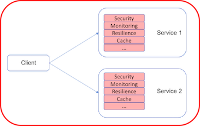

An API gateway provides a single, unified entry point across one or more internal APIs. It is an important element in any microservice architecture.

  

## Why Tree Gateway?

Tree Gateway is a free and open source solution writen in Node JS that has a complete and customizable pipeline to handle your requests.
It provides:

|Tree Gateway  | Features |
| --| --| 
|  **Security** | More than **300 strategies** available to authenticate your users through an easy [passportjs](http://passportjs.org/) integration, including support to **JWT tokens**, **Oauth**, **Basic** and many **others**. Custom strategies can also be writen directly in Javascript.|
|   **Routing** | A flexible and robust **Routing system** that allows any kind onf customized request pipeline. A plugable engine allow any kind of transformations or verifications to your API requests.| 
|   **Rate Limits** | To control quotas for your customers and to define actions to be taken when any quota is exceeded (And again, all customizations can be written as simple javascript functions).| 
|   **Caching** | Allow you to easily inject and control caching behavior for your APIs. Tree Gateway provides two kinds of cache: <ul><li>At browser level - Intercepting the responses and controling how the HTTP cache headers are used.</li><li>At a server level - Caching responses for your APIs in memory (using the redis database).</li></ul> | 
|   **Circuit Breaker** | A fast [circuitbreaker](https://martinfowler.com/bliki/CircuitBreaker.html) to fast fail your responses when your API is having problems to work. It support custom handlers for events like "open" or "close" circuit.| 

  - Real Time **Monitoring and Analytics** - 
    - Collect statistics about any access to your APIs. Capture any event, like a cache hit on a cache entrance, a circuitbreaker open circuit or an authentication attempt.
    - Use an existing monitor (or define your own monitor) to capture periodic information about the server or about your APIs. Ex: CPU monitor, MEM Monitor etc.
    - A very flexible and powerfull log system, that can be integrated with any service like logstash, loggly or new relic.
  - **Easy Administration** - The gateway can be configured remotelly. And no restart is needed. Any API configuration can be "hot" changed and all configurations are propagated to other tree-gateway cluster nodes with no pain. The gateway can be configured through:
    - Admin API - A REST API that can be invoked through HTTP;
    - SDK - A Node JS SDK that can be used to configure the Gateway (or a cluster of gateways) programmatically;
    - CLI - A command line tool can be used to configure using shell commands or scripts.
  - Focused on **Performance** and **High Availability** - Turn easy the creation of big clusters.
    - Support clusters of redis to share configurations, circuitbreaker states, cached content and so on.
    - Automatically propagate events to all cluster nodes.
    - Auto discovery for cluster nodes.
    - Very low resources footprint.

## Try Tree Gateway

Take a better look into Tree Gateway by checking out the project and working with it guided by our [Docs](https://github.com/Leanty/tree-gateway/wiki).